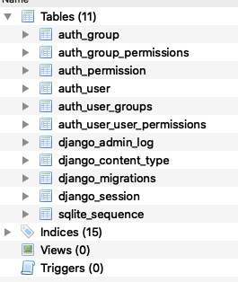
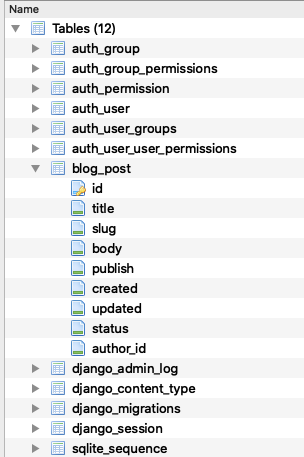
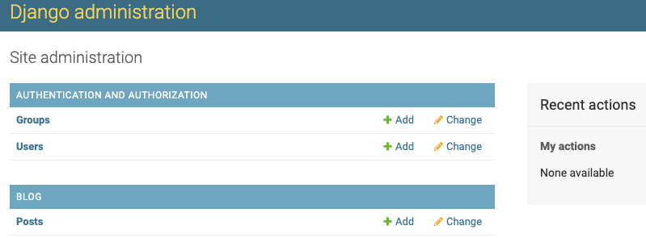
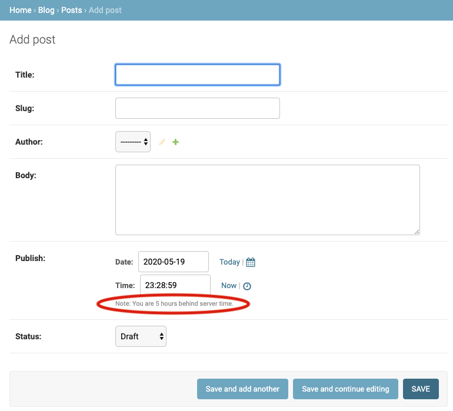
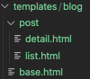
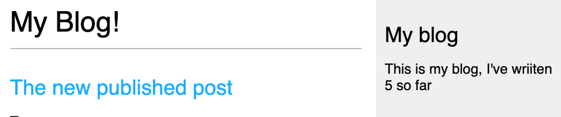
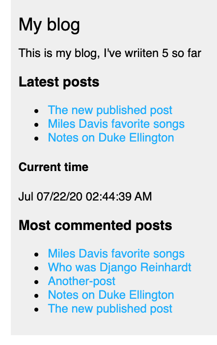
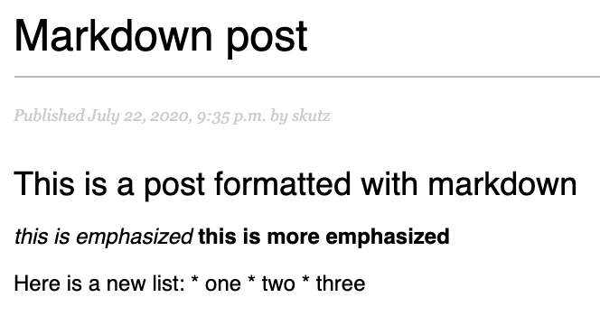
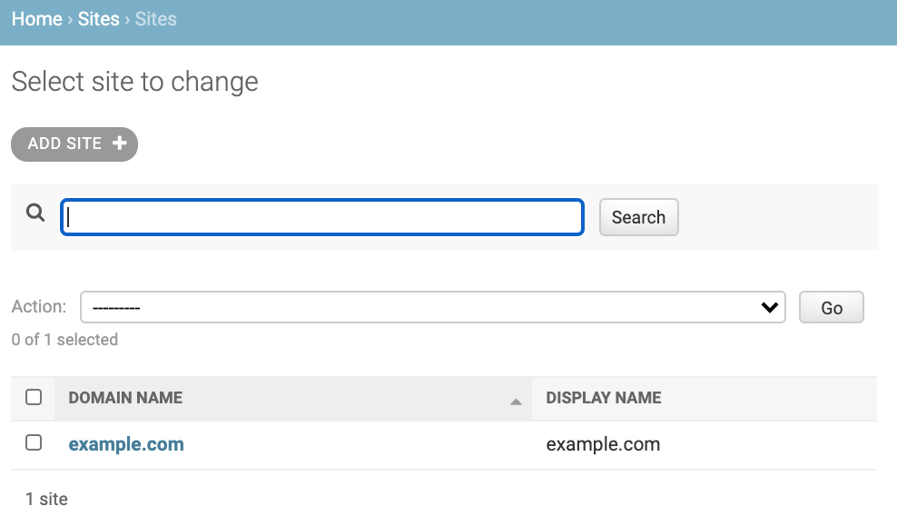
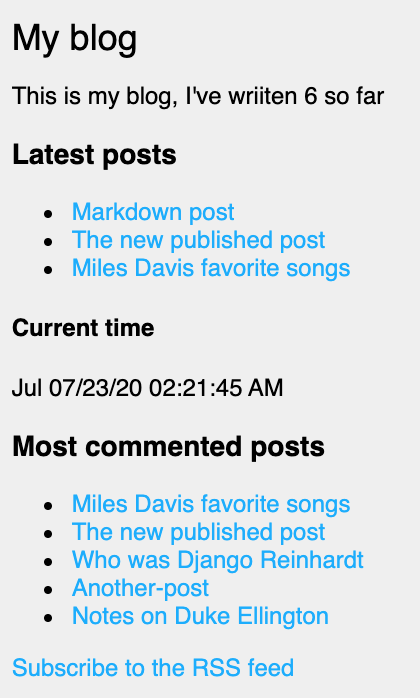

#### Project Setup

1) Create environment

    ~~~ bash
    python3 -m venv my_env
    ~~~

2) Activate virtual environment

    ~~~ bash
    source my_env/bin/activate
    ~~~

3) Install Django

    ~~~ bash
    pip install Django
    ~~~

4) Create `mysite` project

    ~~~ bash
    django-admin startproject mysite
    ~~~

5) Run migration to setup tables for applications

    - NOTE: you must change directory to the project folder before running migration

    ~~~ bash
    cd mysite
    python manage.py migrate
    ~~~

    - The following tables are created

         

6) Run the Django development server to verify installation

    ~~~ bash
    python manage.py runserver
    ~~~

#### Setup blog application

1) Create basic structure of blog application within project folder

    ~~~ py
    python manange.py startapp blog 
    ~~~

2) Create the Post model
   - The Post model subclasses the `django.models.Model` class in which each attribute field represents a database field
   - A `slug` is a short label that contains only letters, underscores, numbers, or hyphens and is used to create SEO-friendly URLs
   - the `author` field creates a `many-to-one` relationship where many posts are associated with a specific author(e.g. User)
   - the `status` field uses a choices parameter to reference the constant `STATUS_CHOICES` in which only one item can be assigned. This constant is a `tuple of tuples`

        ~~~ py
        from django.db import models
        from django.utils import timezone # needed for timestamp of publish, created, & updated attributes
        from django.contrib.auth.models import User

        # Create your models here.
        class Post(models.Model):
            STATUS_CHOICES = (
                ('draft', 'Draft'),
                ('published', 'Published'),
            )

            title = models.CharField(max_length = 250)
            slug = models.SlugField(max_length = 250, unique_for_date = 'publish')
            author = models.ForeignKey(User, on_delete = models.CASCADE, related_name = 'blog_posts')
            body = models.TextField()
            publish = models.DateTimeField(default = timezone.now) # date with timezone info
            created = models.DateField(auto_now_add = True) # date when post initially created
            updated = models.DateTimeField(auto_now=True)
            status = models.CharField(max_length = 10, choices = STATUS_CHOICES, default = 'draft')

            class Meta:     # just a class container with some options (metadata)
                ordering = ('-publish', )   # the negative puts in descending order from most recently published

            def __str__(self):   # creates a human-readable representation of the object
                return self.title
        ~~~

3) Activate the application

    - within `apps.py` is the following class

        ~~~ py
        class BlogConfig(AppConfig):
            name = 'blog'
        ~~~

- add the following to `mysite/settings.py` to activate the app. This tells Django tht this app belongs to projects and to load its models

    ~~~ py
    INSTALLED_APPS = [
        'blog.apps.BlogConfig',
        'django.contrib.admin',
    ~~~

4) Create initial migration for the `Post` model 

    - this defines how the database will be modified
     
        ~~~ py
        python manage.py makemigrations blog
        ~~~

    - to see the SQL(it won't actually be run) that Django will run to implement the migration, run the following

       ~~~ py
       python manage.py sqlmigrate blog 0001
       ~~~

5) Apply the migration

    ~~~ py
    python manage.py migrate
    ~~~

    - the database now has the `blog_post` table

        

#### Setup Admin

1) Create `superuser`

    ~~~ py
    python manage.py createsuperuser
    ~~~

2) Register models to admin site

    - orig

        ~~~ py
          from django.contrib import admin
        ~~~

    - updated 
        ~~~ py
        from django.contrib import admin
        from .models import Post

        # Register your models here.
        admin.site.register(Post)
        ~~~
    
3) Launch server and log into admin panel at URL `http://127.0.0.1:8000/admin` to see the admin panel

    

4) Select Add post and note timezone message

    - message varies depending on your actual timezone

        

        - this can be resolved by modifying `TIME_ZONE` in `settings.py` to your actual timezone

        - before

            ~~~ py
            TIME_ZONE = 'UTC'
            ~~~

        - after

            ~~~ py
            TIME_ZONE = 'America/Chicago'
            ~~~

    - However, modifying `TIME_ZONE` can cause issues with Daylight Savings Time. It is recommended to use `UTC` time in the database and convert to `local time` for user interactions. <a href = "https://docs.djangoproject.com/en/3.0/topics/i18n/timezone"> see Time zones Django documentation</a>  

#### Customize admin model

1) Add the following model to `admin.py`

    - note the `admin options` 
        
        -  <a href = "https://docs.djangoproject.com/en/3.0/ref/contrib/admin/"> Django admin options </a>

        ~~~ py
        from django.contrib import admin
        from .models import Post

        # Register your models here.
        # admin.site.register(Post)

        # Custom models 
        @admin.register(Post)   # decorator performs same as admin.site.register(Post)
        class PostAdmin(admin.ModelAdmin):
           list_display = ('title', 'slug', 'author', 'publish', 'status')
           list_filter = ('status', 'created', 'publish', 'author')
           search_fields = ('title', 'body')
           prepopulated_fields = {'slug': ('title',)}
           raw_id_fields = ('author',)
           date_hierarchy = 'publish'
           ordering = ('status', 'publish')
        ~~~

#### Create list & detail views

1) Add the following views

    ~~~ py
    from django.shortcuts import render, get_object_or_404
    from .models import Post

    # Create your views here.
    def post_list(request):
        posts = Post.published.all()
        return render(request, 'blog/post/list.html', {'posts': posts})

    def post_detail(request, year, month, day, post):
        post = get_object_or_404(Post, 
            slug = post, 
            status = 'published', 
            publish__year = year,
            publish__month = month,
            publish__day = day)    

        return render(request, 'blog/post/detail.html', {'post': post}) 
    ~~~

2) Add URL patterns for views in the blog app

    - this maps URLs to views
    - the first pattern does not have arguments
    - the second pattern take four arguments
    - angle brackets are used to capture values from a URL as a strings
    - `path converters` are used to capture values. For example, <int:year> looks for a int parameter and returns an integer.  Likewise, <slug:post> matches a slug string
    - <a href = "https://docs.djangoproject.com/en/3.0/topics/http/urls/#path-converters"> Django path converters</a>
    - `name` maps the view
        ~~~ py
        from django.urls import path
        from . import views

        app_name = 'blog'

        urlpatterns = [
            # post views
            path('', views.post_list, name = 'post_list'),
            path('<int:year>/<int:month>/<int:day>/<slug:post>/', views.post_detail, name = 'post_detail'),
            
        ]
        ~~~

3) Update the project `urls.py`

    - add the `include` import

    - add the following to the `urlpatterns` variable

    - the `namespace` blog allow precise reversing of `names URL patterns`

        ~~~ py

        from django.urls import path, include

        urlpatterns = [
            path('admin/', admin.site.urls),
            path('blog/', include('blog.urls', namespace = 'blog')),

        ]

        ~~~

#### Implement Canonical URLs for models

    - Canonical means `preferred` and is a unique URL
    - the `reverse` method allows URLs to be built using their name and also allows passing additional parameters

    - Add the following to `models.py`
    - import `reverse`

        ~~~ py
        from django.urls import reverse
        ~~~

    - create `get_absolute_url` method to link to specific posts

        ~~~ py

        def get_absolute_url(self):
            return reverse("blog:post_detail",   # define args next, kwargs can also be implmented
                             args=[self.publish.year,
                                   self.publish.month,
                                   self.publish.day,
                                   self.slug ])
        
        ~~~

#### Update the models
    - import `reverse`

        ~~~ py
        from django.urls import reverse
        ~~~

    - 

#### Create templates for the views    

1) Set up the following folders and files inside the `blog` app

    

   - use template tags, template variables, and template filters to create templates

2) Create the `base.html` template

    - utilizes `static files`

        ~~~ html
        
        <!DOCTYPE html>
        <html>
            <head>
               <title>  </title>
               <link href = "" rel = "stylesheet">
            </head>

            <body>

                

                    

                    

                

                

                    <h2> My blog </h2>
                    
 This is my blog 

                

            </body>

        </html>
        ~~~

3) Create the `list.html`template

    - `extends` allows this template to inherit from the `base.html` file
    - Two template filters are applied in the body of the post

        ~~~ html
        

         My Blog 

        
            <h1> My Blog! </h1>

            
                <h2>
                    <a href = "{{ post.get_absolute_url }}">
                        {{ post.title }}
                    </a>
                </h2>

                

                    Published {{ post.publish }} by {{ post.author }}
                

                {{ post.body|truncatewords:30|linebreaks}}

            

        
        ~~~

4) Create `detail.html` template

    ~~~ html
    

     {{ post.title }} 

    
        <h1> {{post.title}} </h1>
        

            Published {{post.publish}} by {{post.author}}
        

        {{post.body|linebreaks}}
     
    ~~~

#### Add Pagination

1) In `views.py` add the following import

    ~~~ py
    from django.core.paginator import Paginator, EmptyPage, PageNotAnInteger
    ~~~

2) Within `template\blog` create `pagination.html` template

    ~~~ html
    

        
        
            <a href = "?page = {{ page.previous_page_number }}">Previous</a>
        

            
                Page {{page.number}} of {{page.paginator.num_pages}}. 
            

            
                <a href = "?page={{page.next_page_number }}">Next</a>
            
        
    

    ~~~

3) Within the `list.html` template, add the following to refer to the pagination template

    ~~~ html
    ...
    

        

    
    ~~~

#### Using Class-based views

- Views are implemented as Python objects instead of functions

1) Add `from django.views.generic import ListView` to `views.py`

2) Create the following class-based view in `views.py`

- The following two lines are analogous and create the queryset

    ~~~ py
        model = Post
        # queryset = Post.published.all()
    ~~~

- Although `object_list` is generically created for the query results, using `context_object_name` makes your code easier to follow

    ~~~ py
    class PostListView(ListView):
        model = Post
        # queryset = Post.published.all()
        context_object_name = 'posts'
        paginate_by = 3
        template_name = 'blog/post/list.html'
    ~~~

3) Modify `blog\urls.py` to use the `PostListView` class

    ~~~ py
    urlpatterns = [
        # post views
        # path('', views.post_list, name = 'post_list'),
        path('', views.PostListView.as_view(), name = 'post_list'),
        ...
    ~~~

4) Update the `list.html` file to receive an obj

    - NOTE: you must not put any spaces within `page=page_obj`

        ~~~ html
            

            <!--   -->
            
        

        ~~~

5) Add a link to return to the main blogs page

    ~~~ html
    <a href = '/blog'> return to all blogs </a>
    ~~~

### Adding Forms to blog

1) Create a `forms.py` file inside the blog app

    - this subclassess the base Form class
    - the CharField typicially renders as a HTML `input` element
    - `widget = forms.Textarea` overrides this and renders as an HTML `textarea` element
    - email validation is done on anything with `EmailField()`
    - <a href = 'https://docs.djangoproject.com/en/3.0/ref/forms/fields/'> Django Form Fields documentation </a>

        ~~~ py
        from django import forms

        class EmailPostForm(forms.Form):
           name = forms.CharField(max_length = 25)
           email = forms.EmailField()
           to = forms.EmailField()
           comments = forms.CharField(required = False, widget = forms.Textarea)
        ~~~

2) Create a view for the form

    - add the `EmailPostForm` import to `views.py`

    ~~~ py
    from .forms import EmailPostForm
    ~~~

    - Add the `post_share` view

    - it has both `request` & `post_id` as parameters
    - `get_object_or_404` verifies that post has `published status`
    - the same view is used for initial blank forms as well as forms with submitted data
    - a `GET` request indicates an empty form has to be displayed
    - a `POST` request indicates that valid form data has been submitted for the form to process
    - `request.method = POST` distinguishes between these two scenarios

#### Sending emails with Django

1) Django will write emails to the console if this is added to `settings.py`

    ~~~ py
    EMAIL_BACKEND = 'django.core.mail.backends.console.EmailBackend'
    ~~~

2) To use the SMTP server for `gmail`, add the following with a valid `gmail` account
   
    - IMPORTANT !! You can hide this info from tracking this sensitive info in github by going into the directory and issuing the following command to halt tracking changes on settings.py
    - TLS is a cryptographic protocol that provides end-to-end security of data sent between applications over the Internet.
    - 
        ~~~ bash
        git update-index --assume-unchanged settings.py
        ~~~

        NOTE - This will restore tracking changes !
        ~~~ bash
        git update-index --no-assume-unchanged settings.py
        ~~~

        ~~~ py
        EMAIL_HOST = 'smtp.gmail.com'
        EMAIL_HOST_USER = 'valid_gmail_account@gmail.com'
        EMAIL_HOST_PASSWORD = 'password for the account'
        EMAIL_PORT = 587
        EMAIL_USE_TLS = True
        ~~~

3) Modify `views.py`

    - import send_mail

        ~~~ py
        from django.core.mail import send_mail
        ~~~

    - modify `post_share` in `views.py`
        - A URI (Uniform Resource Identifier) is a string that refers to a resource such as a URL
        - get_absolute_url() method to tell Django how to calculate the canonical URL for an object. To callers, this method should appear to return a string that can be used to refer to the object over HTTP.
        - an example of cd is `cd is {'name': 'ME', 'email': 'sktestdjango@gmail.com', 'to': 'sktestdjango@gmail.com', 'comments': 'Some comment'}`

            ~~~ py
            def post_share(request, post_id):
                # Retrieve post by ID
                post = get_object_or_404(Post, id = post_id, status = "published")
                sent = False

                if request.method == 'POST':
                    # form was submitted with data
                    form = EmailPostForm(request.POST)
                    if form.is_valid():
                        # Form fields passed validation
                        cd = form.cleaned_data 
                        # ... send email
                        post_url = request.build_absolute_uri(post.get_absolute_url())
                        subject = f"{cd['name']} recommends you read " f"{post.title}"
                        message = f"Read {post.title} at {post_url} \n\n" f"{cd['name']}\'s comments: {cd['comments']}"
                        send_mail(subject, message, 'sktestdjango@gmail.com', [cd['to']])
                        sent = True

                else:  # show blank form
                    form = EmailPostForm()

                context = {'post': post, 'form': form, 'sent': sent}

                return render(request, 'blog/post/share.html', context)  
            ~~~

4) Add the path in `/blogs/urls.py`    

    ~~~ py
    urlpatterns = [
        # post views
        # path('', views.post_list, name = 'post_list'),
        path('', views.PostListView.as_view(), name = 'post_list'),
        path('<int:year>/<int:month>/<int:day>/<slug:post>/', views.post_detail, name = 'post_detail'),
        path('<int:post_id>/share/', views.post_share, name = 'post_share'),
    ]
    ~~~

5) Create the `share` template inside `blog/post`

    ~~~ html
    

     Share a post 

    
        
            <h1> E-mail successfully sent </h1>
            
 
                "{{ post.title}}" was successfully sent to {{ form.cleaned_data.to}}.
            

        
            <h1> Share "{{ post.title }}" by e-mail </h1>
            <form method = "post">
            <!-- Example data that is looped in
            cd is {'name': 'ME', 'email': 'sktestdjango@gmail.com', 'to': 'sktestdjango@gmail.com', 'comments': 'DEBUG test AGAIN'}  -->    
                
                
                    

                        {{ field.errors }}
                        {{ field.label_tag }} {{ field }}
                    

                
                
                <input type = "submit" value = "Send e-mail">
            </form>
            

    

    ~~~

#### Comment functionality

1) Add a model for storing comments

    - The `ForeignKey` associates one `Post` to many `Commments`
    - this is a `one-to-many` relationship
    - the `related_name` attribute allows retrieval  all of a post's comments using `post.comments.all()`
    - If `related_name` was not defined, Django would use `comment_set` instead
    - Generally, `related_name` is the name to use for the relation from the related object back to this one
    - the `active` attribute allows for comments to be turned off(e.g. hidden)

        ~~~ py
        class Comment(models.Model):
            post = models.ForeignKey(Post, on_delete=models.CASCADE, related_name='comments')
            name = models.CharField(max_length=80)
            email = models.EmailField()
            body = models.TextField()
            created = models.DateTimeField(auto_now_add = True)
            updated = models.DateTimeField(auto_now=True)
            active = models.BooleanField(default = True)

            class Meta:  # just a class container with some options (metadata)
               ordering: ('created',)

            def __str__(self):
               return f'Comment by {self.name} on {self.post}' 
        ~~~

2) Create a new migration in terminal of the virtual environment

    ~~~ bash
    python manage.py makemigrations blog
    ~~~

3) Run the migration

    ~~~ bash
    python manage.py migrate
    ~~~

4) Register model with the admin interface in `admin.py`

    - include the `Comment` import

    - add the custom Model

        ~~~ py
        @admin.register(Comment)
        class CommentAdmin(admin.ModelAdmin):
           list_display = ('name', 'email', 'post', 'created', 'active' )
           list_filter = ('active', 'created', 'updated')
           search_fields = ('name', 'email', 'body')
        ~~~

5) Modify `forms.py` to allow dynamically built forms from `Comment` model

    - include the `Comment` import

    - add the following class

        ~~~ py
        class CommentForm(forms.ModelForm):
            class Meta:
                model = Comment
                fields = ('name', 'email', 'body')
        ~~~

6) Modify the `post_detail` view    

    - import the `Comment` model and `CommentForm`

        ~~~ py
        from .models import Post, Comment
        from .forms import EmailPostForm, CommentForm
        ~~~

        ~~~ py
        def post_detail(request, year, month, day, post):
            post = get_object_or_404(Post, 
                                   slug = post, 
                                   status = 'published', 
                                   publish__year = year,
                                   publish__month = month,
                                   publish__day = day)    

            # list of active comments for this post
            comments = post.comments.filter(active = True)

            new_comment = None

            if request.method == 'POST':
                # A comment was posted
                comment_form = CommentForm( data=request.POST )

                if comment_form.is_valid():
                    # create comment obj but do not save to database yet
                    new_comment = comment_form.save(commit = False)
                    # Assign current post to comment
                    new_comment.post = post
                    # Save the comment to the database
                    new_comment.save()

            else:  # provide blank comment form
                comment_form = CommentForm()

            context = {'post': post, 'comments': comments, 
                      'new_comment': new_comment, 'comment_form': comment_form }

            return render(request, 'blog/post/detail.html', context) 
        ~~~

7) Add comments to `post_detail` template content block

    ~~~ py
        
            <h2>
                {{ total_comments }} comment {{ total_comments|pluralize }}
            </h2>
          

        
                

                    

                        Comment {{ forloop.counter }} by {{ comment.name }}
                    

                    {{ comment.body|linebreaks }}
                

            
                
 There are no comments yet 
    
            
        
            <h2> Your comment has been added </h2>
        
            <h2> Add a new comment </h2>
            <form method = 'post'>
                {{ comment_form.as_p }}
                
                

                    <input type = "submit" value = "Add Comment">
                

            </form>

        
    ~~~
   
8) Move `return to all blogs` link to below `Share this post link`

    ~~~ html
        

            <a href = ""> Share this post <a/>
        

        

            <a href = '/blog'> return to all blogs </a>
        

    ~~~

#### Add tagging functionality

1) Utilize the 3rd party app `django-taggit`

    - from virtual environment in terminal run

        ~~~ bash
        pip install django_taggit
        ~~~

 2) Add the app to `INSTALLED_APPS` in `settings.py`

    ~~~ py
    ...
    INSTALLED_APPS = [
        'blog.apps.BlogConfig',
        'taggit',
        'django.contrib.admin',
    ...
    ~~~

 3) Add `taggit` to `models.py`

    - import taggit

        ~~~ py
        from taggit.managers import TaggableManager
        ~~~

    - append to the `Post` model
    - the `tags` manager allows adding, retreiving, &  removal of tags from `Post` objects
        ~~~ py
        tags = TaggableManager()
        ~~~

4) Create a migration for the changes to `model.py`

    ~~~ py
    python manage.py makemigrations blog
    ~~~ 

5) Run migration

    ~~~ py
    python manage.py migrate
    ~~~

6) Modify the `list` template to display tags

    - the `join` template filter
    - <a href = "https://docs.djangoproject.com/en/3.0/ref/templates/builtins/#filter"> Django template filters </a>

        ~~~ py
            ...
            {{ post.title }}

            
 Tags: {{ post.tags.all|join:", " }}

            ...
    ~~~

7) Modify `views.py` to allow listing of posts with a specific tag

    - import `Tag` model

        ~~~ py
            from taggit.models import Tag
        ~~~

    - modify `post_list` view to filter posts by tag

        ~~~ py
            def post_list(request, tag_slug = None):
                object_list = Post.published.all()
                
                tag = None

                if tag_slug:
                    tag = get_object_or_404(Tag, slug = tag_slug)
                    object_list = object_list.filter(tags__in = [tag])
        ~~~

    - include `tags` in the `context`

        ~~~ py
            context = {'page': page, 'posts': posts, 'tag': tag}
        ~~~

 8) Modify `urls.py`

- `name` allows calling the same view with and without parameters

    ~~~ py
        urlpatterns = [
            # post views
            path('', views.post_list, name = 'post_list'),
            # path('', views.PostListView.as_view(), name = 'post_list'),
            path('tag/<slug:tag_slug>/', views.post_list, name = 'post_list_by_tag'),
            path('<int:year>/<int:month>/<int:day>/<slug:post>/', views.post_detail, name = 'post_detail'),
            path('<int:post_id>/share/', views.post_share, name = 'post_share'),
        ]
    ~~~

9) Modify the `list` template

    - before
        ~~~ html
            

             My Blog 

            
                <h1> My Blog! </h1>

                
                    <h2>
                        <a href = "{{ post.get_absolute_url }}">
                            {{ post.title }}
                        </a>
                    </h2>

                    

                        Published {{ post.publish }} by {{ post.author }}
                    

                    {{ post.body|truncatewords:30|linebreaks}}

                

                <!--   -->
                
            
        ~~~

    - after

        ~~~ html
            

             My Blog 

            
                <h1> My Blog! </h1>

                
                    <h2> posts tagged with "{{ tag.name }}" </h2>
                

                
                    <h2>
                        <a href = "{{ post.get_absolute_url }}">
                            {{ post.title }}
                        </a>
                    </h2>

                    

                        Tags:
                        
                            <a href = "">
                                {{ tag.name }}
                            </a>
                            , 
                        
                    

                    

                        Published {{ post.publish }} by {{ post.author }}
                    

                    {{ post.body|truncatewords:30|linebreaks}}

                    

                
                <!--  -->
            
        ~~~

#### Retrieve similar posts

1) Modify `views.py` 

    - add `Count` import

        ~~~ py
        from django.db.models import Count
        ~~~

    - add the following to the bottom of the `post_detail` function
    - the last four aggregated posts are sliced using the calculated field `-same_tags`

        ~~~ py
            post_tags_ids = post.tags.values_list('id', flat = True)
            similar_posts = Post.published.filter(tags__in=post_tags_ids).exclude(id=post.id)
            similar_posts = similar_posts.annotate(same_tags=Count('tags')).order_by('-same_tags', '-publish')[:4]

            context = {'post': post, 'comments': comments, 
                    'new_comment': new_comment, 'comment_form': comment_form,
                    'similar_posts': similar_posts }

            return render(request, 'blog/post/detail.html', context)  
        ~~~

2) Modify the `detail` template to show posts that are similar

    ~~~ py
        ...
        {{post.body|linebreaks}}

            

                <a href = ""> Share this post </a>
            

            <h2> Similar Posts </h2>
            
                

                    <a href = "{{ post.get_absolute_url }}"> {{post.title}} </a>
                

            
                There are no similar posts yet
            

            

                <a href = '/blog'> return to all blogs </a>
            

        ...
    ~~~

#### Using custom template tags

<a href = "https://docs.djangoproject.com/en/3.0/howto/custom-template-tags/"> Django Cusomter template tags documentation </a>

1) Create a `templatetags` directory inside the `blog` app

2) Add the following two files to the `templatetags` directory

   - `__init__.py`

   - `blog_tags.py`

3) Add the following to the `blog_tags` file

- `Django` uses the `simple_tag` decorator to use the function name as the tag name. To create a custom name, append `(name='CustomName')` to `.simple_tag`
- the `register` variable is an instance of `template.Library()` and it regsiters the custom tags and filters

    ~~~ py
    from django import template
    from ..models import Post

    register = template.Library()

    @register.simple_tag
    def total_posts():
        return Post.published.count

    ~~~

4) Update `base.html` to utilize `blog_tags`

    ~~~ html
    
    
    <!DOCTYPE html>
    <html>
        <head>
            <title>  </title>
            <link href = "" rel = "stylesheet">
        </head>

        <body>

            

                

                
            

            

                <h2> My blog </h2>
                
 This is my blog, I've wriiten  so far 

            

        </body>

    </html>
    ~~~

   - The `blog` page will now show the `total_posts` custom tag

    

5) Add the following to `blog_tags.py`

     - show current_time is just used to demonstrate anther way to use a simple_tag that is named `time_now`

     ~~~ py
     import datetime

     register = template.Library()

     format_string = "%b %x %X %Z %p"

     @register.simple_tag
     def total_posts():
     return Post.published.count()

     @register.simple_tag(name = 'time_now')
     def show_current_time():
          return datetime.datetime.now().strftime(format_string)
     ~~~

     - the inclusion tag allows rendering of context variables into a template
     - the `blog/post/latest_posts.html` template renders the `latest_posts` context variable
     - this function returns a `dictionary`

     ~~~ py
     @register.inclusion_tag('blog/post/latest_posts.html')
     def show_latest_posts(count=5):
     latest_posts = Post.published.order_by('-publish')[:count]
     return {'latest_posts': latest_posts}
     ~~~

6) Create the `blog/post/latest_posts.html` template

     - the URL & title of each item in the `latest_posts` dictionary is rendered in the template

     ~~~ html
     <ul>
          
               <li>
                    <a href = "{{ post.get_absolute.url }}"> {{ post.title }} </a>
               </li>
          
     </ul>
     ~~~

7) Modify `base.html` to render the `context variable`

     - 

     ~~~ html
          

               <h2> My blog </h2>
               
 This is my blog, I've wriiten  so far 

          
               <h3> Latest posts </h3>
               
               <h4> Current time </h4>
                         
          

     ~~~

8) Add a `simple tag` that returns a reusable value in `django_blog_postgres`

     - a `QuerySet` using the `annotate` function will aggregate the total number of post comments
     - the `Count` function will store the total number in the `total_comments` variable
     - the `-` sign puts the results in descending order
     - the `count` variable is optional and limits the total objects returned to 5

     - make sure that `Count` is imported

     ~~~ py
     from django.db.models import Count
     ~~~

     ~~~ py
     @register.simple_tag
     def get_most_commented_posts(count = 5):
          return Post.published.annotate(total_comments = Count('comments')).order_by('-total_comments')[:count]   
     ~~~

9) Update the `base.html` template

     - the variable returned is stored in a new variabled called `most_commented_posts`

     ~~~ html
          

               <h2> My blog </h2>
               
 This is my blog, I've wriiten  so far 

          
               <h3> Latest posts </h3>
               
               <h4> Current time </h4>
               
               <h3> Most commented posts </h3>
               
               <ul>
                    
                         <li>
                              <a href = "{{post.get_absolute_url}}"> {{post.title}} </a>
                         </li>
                         
               </ul>
          

     ~~~

     - the sidebar will now show all of the custom template tags

     

#### Custom template filters

1) `Markdown` syntax can be converted to HTML in templates after installing the Python markdown module
   
     - Special Python functions that accept 1 or 2 parameters and an optional argument
     - Value returned can be sent into a another filter

     <a href = "https://python-markdown.github.io/" > Python Markdown </a>

     <a href = "https://docs.djangoproject.com/en/3.0/ref/templates/builtins/#built-in-filter-reference"> Django filter reference </a>

     <a href = "https://docs.djangoproject.com/en/3.0/howto/custom-template-tags/#writing-custom-template-filters"> Django custom template filter reference </a>

     - install `markdown` within the `virtual environment`

     ~~~ bash
     pip install markdown
     ~~~

2) Create a custom filter to use Markdown in blog posts and then convert to HTML in templates in `blog_tags.py`

     - by default, `Django` will escape HTML code to prevent malicious HTML output
     - using the `mark_safe` function will allow Djngo to output the HTML
     - the function is named to prevent conflicts

     - import the following

     ~~~ py
     from django.utils.safestring import mark_safe
     import markdown
     ~~~

     ~~~ py
     @register.filter(name = "markdown")
     def markdown_format(text):
          return mark_safe(markdown.markdown(text))
     ~~~

 3) Add the following to load template tags in `list.html` & `detail.html` below the `extends tag`

     ~~~ html
     
     ~~~

4) In `details.html` 

     replace `{{post.body|linebreaks}}`

     with `{{post.body|markdown}}`

5) In `list.html` 
   
     replace `{{ post.body|truncatewords:30|linebreaks}}`
     
     with ` {{ post.body|markdown|truncatewords_html:30 }}`

6) Open the URL to `http://127.0.0.1:8000/admin/blog/post/add/` and the following to the body section

     ~~~ text
     This is a post formatted with markdown
     --------------------------------------

     *this is emphasized*  **this is more emphasized**

     Here is a new list:
     * one
     * two
     * three
     ~~~

     - the following should will be rendered on the blog site

     

#### Creating a sitemap

1) Add the following to `settings.py` and define a `site ID`

     - `Django` includes a `sitemap framework` that provides search engines
          - pages of your website
          - relevance
          - update frequency
     - it also associates objects to specific websites running within the project
     - using the `sitemap framework` requires activation of the sites and the sitmap applications

     ~~~ py
     # Application definition

     SITE_ID = 1

     INSTALLED_APPS = [
     'blog.apps.BlogConfig',
     'taggit',
     'django.contrib.admin',
     'django.contrib.auth',
     'django.contrib.contenttypes',
     'django.contrib.sessions',
     'django.contrib.messages',
     'django.contrib.staticfiles',
     'django.contrib.sites',
     'django.contrib.sitemaps',

     ]
     ~~~

2) Create tables for the `Django` site application by runnning a migration in the terminal of the virtual environment

     ~~~bash 
     python manage.py migrate
     ~~~

     - the following is expected in the terminal

     ~~~ bash
     Operations to perform:
     Apply all migrations: admin, auth, blog, contenttypes, sessions, sites, taggit
     Running migrations:
     Applying sites.0001_initial... OK
     Applying sites.0002_alter_domain_unique... OK
     ~~~

3) Create the `sitemps.py` file inside the `blog` folder

     - a `sitemap` is an `XML` file that provides info to `search engines`
     - the custom sitemap inherits from the `Sitemap` class
     - `relevance` is determined from the `priority` attribute
     - `update frequency` is determined from the `changefreq` attribute
     - `items` returns a `QuerySet` of objects used in the sitemap
     - `absolute_URL` determines the `URL` of each post
     - `location` can be used to find the `URL` of each object
     - `lastmod` provides the most recent update timestamp
     - NOTE: `changefreq` & `priority` can be used as `attributes` OR `methods`
     - <a href = "https://docs.djangoproject.com/en/3.0/ref/contrib/sitemaps/"> Django SiteMap framework </a>

     ~~~ py
     from django.contrib.sitemaps import Sitemap
     from .models import Post

     class PostSitemap(Sitemap):
          changefreq = 'weekly'
          priority = '0.9'    # max is 1

          # Django will call the get_abolsute_url method created in Post model
          #    def get_absolute_url(self):
          def items(self):
               return Post.published.all()

          # should return a datetime obj
          # defined in Post model as
          #    updated = models.DateTimeField(auto_now=True)
          def lastmod(self, obj):
               return obj.updated 
     ~~~

4) Add `sitemap URL` to the project's `urls.py` file

     - the following imports are required

     ~~~ py
     from django.contrib.sitemaps.views import sitemap
     from blog.sitemaps import PostSitemap
     ~~~

     - NOTE: changes to a sitemap can `ping` Google 
     - <a href = "https://docs.djangoproject.com/en/3.0/ref/contrib/sitemaps/#django.contrib.sitemaps.ping_google"> Ping Google </a>

     ~~~ py
     # a custom sitemaps dictionary can be created and passed to the sitemap view
     sitemaps = {
          'posts': PostSitemap,
     }

     urlpatterns = [
          path('admin/', admin.site.urls),
          path('blog/', include('blog.urls', namespace = 'blog')),
          path('sitemap.xml', sitemap, {'sitemaps': sitemaps}, name = 'django.contrib.sitemaps.views.sitemap')
     ]
     ~~~

5) Open `http://127.0.0.1:8000/sitemap.xml`  in the browser to view the XML output of `sitemap.xml`

     - each `url` tag is creaated using info returned from the `get_absolute_url` method in the `Post` model
     - the site is defined as `example.com` as defined in the `Site` obj in the database

     ~~~ xml
     <urlset xmlns="http://www.sitemaps.org/schemas/sitemap/0.9">
          <url>
               <loc>http://example.com/blog/2020/7/22/markdown-post/</loc>
               <lastmod>2020-07-22</lastmod>
               <changefreq>weekly</changefreq>
               <priority>0.9</priority>
          </url>
          <url>
               <loc>http://example.com/blog/2020/5/22/new-published-post/</loc>
               <lastmod>2020-05-22</lastmod>
               <changefreq>weekly</changefreq>
               <priority>0.9</priority>
          </url>
          <url>
               <loc>http://example.com/blog/2020/5/22/miles-davis-favorite-songs/</loc>
               <lastmod>2020-05-27</lastmod>
               <changefreq>weekly</changefreq>
               <priority>0.9</priority>
          </url>
          <url>
               <loc>http://example.com/blog/2020/5/22/notes-duke-ellington/</loc>
               <lastmod>2020-05-27</lastmod>
               <changefreq>weekly</changefreq>
               <priority>0.9</priority>
          </url>
               <url>
               <loc>http://example.com/blog/2020/5/20/another-post/</loc>
               <lastmod>2020-05-20</lastmod>
               <changefreq>weekly</changefreq>
               <priority>0.9</priority>
          </url>
               <url>
               <loc>http://example.com/blog/2020/5/20/Who-was-Django-Reinhardt/</loc>
               <lastmod>2020-05-27</lastmod>
               <changefreq>weekly</changefreq>
               <priority>0.9</priority>
          </url>
     </urlset>
     ~~~

6) Open `http://127.0.0.1:8000/admin/sites/site/` to see the admin view of the site's framework

     

7) Change the `Domain name` to `localhost:8000` and note that the url location is now updated

     ~~~ xml
     <urlset xmlns="http://www.sitemaps.org/schemas/sitemap/0.9">
          <url>
               <loc>http://localhost:8000/blog/2020/7/22/markdown-post/</loc>
               <lastmod>2020-07-22</lastmod>
               <changefreq>weekly</changefreq>
               <priority>0.9</priority>
          </url>
          <url>
               <loc>http://localhost:8000/blog/2020/5/22/new-published-post/</loc>
               <lastmod>2020-05-22</lastmod>
               <changefreq>weekly</changefreq>
               <priority>0.9</priority>
          </url>
          <url>
               <loc>http://localhost:8000/blog/2020/5/22/miles-davis-favorite-songs/</loc>
               <lastmod>2020-05-27</lastmod>
               <changefreq>weekly</changefreq>
               <priority>0.9</priority>
          </url>
          <url>
               <loc>http://localhost:8000/blog/2020/5/22/notes-duke-ellington/</loc>
               <lastmod>2020-05-27</lastmod>
               <changefreq>weekly</changefreq>
               <priority>0.9</priority>
          </url>
          <url>
               <loc>http://localhost:8000/blog/2020/5/20/another-post/</loc>
               <lastmod>2020-05-20</lastmod>
               <changefreq>weekly</changefreq>
               <priority>0.9</priority>
          </url>
          <url>
               <loc>http://localhost:8000/blog/2020/5/20/Who-was-Django-Reinhardt/</loc>
               <lastmod>2020-05-27</lastmod>
               <changefreq>weekly</changefreq>
               <priority>0.9</priority>
          </url>
     </urlset>
     ~~~

#### Creating feeds

1) Create `feeds.py` inside the `blog` app folder

     - `Django` can be  configured to create `RSS` or `Atom` feeds for updated content
     - the feeds are usually generated in `XML` format by a `feed aggregator`
     - <a href = "https://docs.djangoproject.com/en/3.0/ref/contrib/syndication/"> Django Syndication Feed framework </a>
     - the `reverse()` method allows for URLs to be created from their `name` and other optional params
     - `items()` retrieves objects to be used in the feed

     ~~~ py
     from django.contrib.syndication.views import Feed
     from django.template.defaultfilters import truncatewords
     from django.urls import reverse_lazy
     from .models import Post

     class LatestPostsFeed(Feed):
          title = 'My Blog'
          link = reverse_lazy('blog:post_list')
          description = 'New posts of my own'

          def items(self):
               return Post.published.all()[:5]

          def item_title(self, item):
               return item.title  

          def item_description(self, item):
               return truncatewords(item.body, 30)   
     ~~~

2) Modify the `blog` app's `urls.py` file

     - include the import

     ~~~ py
     from .feeds import LatestPostsFeed
     ~~~

     - add the feed route to `urlpatterns`

     ~~~ py
     urlpatterns = [
     # post views
     path('', views.post_list, name = 'post_list'),
     # path('', views.PostListView.as_view(), name = 'post_list'),
     path('tag/<slug:tag_slug>/', views.post_list, name = 'post_list_by_tag'),
     path('<int:year>/<int:month>/<int:day>/<slug:post>/', views.post_detail, name = 'post_detail'),
     path('<int:post_id>/share/', views.post_share, name = 'post_share'),
     path('feed/', LatestPostsFeed(), name = 'post_feed'),
     ]
     ~~~

3) Navigate to `http://127.0.0.1:8000/blog/feed/` to view the RSS feed

     ~~~ RSS
     <?xml version="1.0" encoding="utf-8"?>
     <rss version="2.0" xmlns:atom="http://www.w3.org/2005/Atom">
          <channel>
               <title>My Blog</title>
               <link>http://localhost:8000/blog/</link>
               <description>New posts of my own</description>
               <atom:link href="http://localhost:8000/blog/feed/" rel="self"></atom:link>
               <language>en-us</language>
               <lastBuildDate>Thu, 23 Jul 2020 02:13:27 +0000</lastBuildDate>
               <item>
                    <title>Markdown post</title>
                    <link>http://localhost:8000/blog/2020/7/22/markdown-post/</link>
                    <description>This is a post formatted with markdown -------------------------------------- *this is emphasized* **this is more emphasized** Here is a new list: * one * two * three</description>
                    <guid>http://localhost:8000/blog/2020/7/22/markdown-post/</guid>
               </item>
               <item
                    ><title>The new published post</title>
                    <link>http://localhost:8000/blog/2020/5/22/new-published-post/</link>
                    <description>Something in the new published post</description>
                    <guid>http://localhost:8000/blog/2020/5/22/new-published-post/</guid>
               </item>
               <item>
                    <title>Miles Davis favorite songs</title>
                    <link>http://localhost:8000/blog/2020/5/22/miles-davis-favorite-songs/</link>
                    <description>Miles Davis III was an American jazz pianist, bandleader, and composer</description>
                    <guid>http://localhost:8000/blog/2020/5/22/miles-davis-favorite-songs/</guid>
               </item>
               <item>
                    <title>Notes on Duke Ellington</title>
                    <link>http://localhost:8000/blog/2020/5/22/notes-duke-ellington/</link>
                    <description>Edward "Kennedy" Ellington was an American composer, pianist, and leader of a jazz orchestra</description>
                    <guid>http://localhost:8000/blog/2020/5/22/notes-duke-ellington/</guid>
               </item>
               <item>
                    <title>Another-post</title>
                    <link>http://localhost:8000/blog/2020/5/20/another-post/</link>
                    <description>Post body.</description>
                    <guid>http://localhost:8000/blog/2020/5/20/another-post/</guid>
               </item>
          </channel>
     </rss>
     ~~~

4) Add a `feed subscription` to the `sidebar` in `base.html`

     ~~~ html
          <ul>
               
                    <li>
                         <a href = "{{post.get_absolute_url}}"> {{post.title}} </a>
                    </li>
                    
          </ul>
          

               <a href = ""> Subscribe to the RSS feed </a>
          

     ~~~

     

     - the link shows the `RSS feed` as shown above

#### Adding full-text search

1) Install `PostgreSQL`
   
     - The `PostgreSQL` database allows for much more complex search queries than the native `SQLite`

     - <a href = "https://www.postgresql.org/docs/12/textsearch.html"> PostgreSQL full-text search </a>

     - the `psycopg2 PostgreSQL adapter` must be also installed
     - The binary package is a practical choice for development and testing but in production it is advised to use the package built from sources.

     ~~~ bash
     pip install psycopg2-binary
     ~~~

2) Create a user for the PostgreSQL database

~~~ bashREADME
~~~
